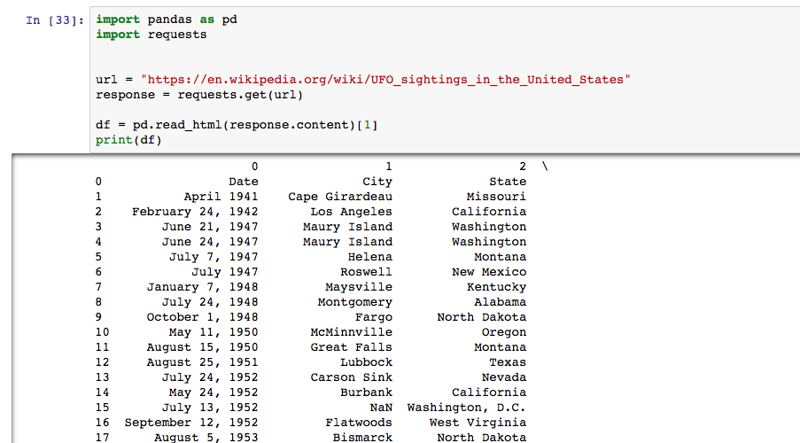
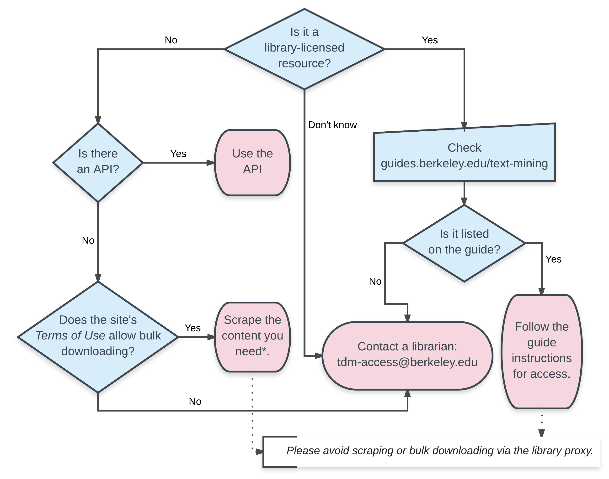

## Data Resources and Moffitt Library Services


UC Berkeley Library 

_Statistics Undergraduate Student Association_

Spring 2018

<!-- `r format(Sys.time(), "%B %Y")` -->

--------


> "An approximate answer to the right question is worth a great deal more than a precise answer to the wrong question."

-John Tukey


## Plan your Research with a Literature Review 

http://www.lib.berkeley.edu/

http://scholar.google.com

http://guides.lib.berkeley.edu/all-guides


## Plan your Research with a Literature Review 


		
## Structure and availability of data


| Unit of Analysis                                                                       	| Geography                                                                          	| Time-Period                                                             	| Frequency                                                                                              	|
|----------------------------------------------------------------------------------------	|------------------------------------------------------------------------------------	|-------------------------------------------------------------------------	|--------------------------------------------------------------------------------------------------------	|
| Aggregated or Microdata?  (counties/nations/households vs. individuals) 	| Is there a geographic  component to your topic?  (U.S., Sub-Saharan Africa, India) 	| Do you want a data for a  specific time period?  (1980-2000, 1930-1960) 	| How often do you want measures  for your variables?  (every year, every ten years, monthly, quarterly) 	|


## Providers

| Researchers                                                    	| Government Agencies                                                                                                                                                                       	| NGO/IGOs                                                                                                                                     	| Research Organizations                                                                                                   	|
|----------------------------------------------------------------	|-------------------------------------------------------------------------------------------------------------------------------------------------------------------------------------------	|------------------------------------------------------------------------------------------------------------------------------------------	|--------------------------------------------------------------------------------------------------------------------------	|
| Are there people you know who are doing this kind of research? 	| Think about government agencies - is the request for some official statistics or data that they'd be likely to collect and publish? (Department of Energy, CDC, Census Bureau) 	| Are there councils or interest organizations devoted to the topic that might collect data independently? (World Bank, OECD) 	| Would any specific research organizations be interested in the topic? (Pew, Roper, Gallup, ACLU ) 	|


<!--
## Mind the 80/20 Rule

> It is often said that 80% of data analysis is spent on the process of cleaning and preparing the data. 


-Dasu and Johnson


## Tidy Data

> “Happy families are all alike; every unhappy family is unhappy in its own way.” 

– Leo Tolstoy


> “Tidy datasets are all alike, but every messy dataset is messy in its own way.” 

– Hadley Wickham


##Tidy Data = Happy Data

Tidy Data has the following attributes:

Each variable forms a column and contains values

Each observation forms a row


-->

## Library Licensed Data Aggregators

[Data Planet](https://libproxy.berkeley.edu/login?qurl=http%3A%2F%2Fstatisticaldatasets.data-planet.com%2Fdataplanet%2F)

[Social Explorer](https://libproxy.berkeley.edu/login?qurl=http%3A%2F%2Fuclibs.org%2FPID%2F163645)

[Policy Map](https://libproxy.berkeley.edu/login?qurl=https%3A%2F%2Fucberkeley.policymap.com%2Fmaps)

[Statista](https://libproxy.berkeley.edu/login?qurl=http%3A%2F%2Fuclibs.org%2FPID%2F224553)


## Data Repositories for Replication Data

[Dataverse](https://dataverse.harvard.edu/)

[ICPSR](https://www.icpsr.umich.edu/icpsrweb/)


## Do-it-yourself approaches


## APIs

https://libraries.mit.edu/scholarly/publishing/apis-for-scholarly-resources/


## Scraping

<small>
https://en.wikipedia.org/wiki/UFO_sightings_in_the_United_States
</small>


##Scraping with Python 




##Scraping with R

```{r, warning=FALSE, message=FALSE}
library(rvest)
library(dplyr)
ufo <- read_html("https://en.wikipedia.org/wiki/UFO_sightings_in_the_United_States")

ufo_date <- html_nodes(ufo,'td:nth-child(1)') %>% html_text() 
ufo_date <- ufo_date[c(-1, -44)] #remove extra elements
ufo_state <- html_nodes(ufo,'td:nth-child(3)') %>% html_text()
ufo_name <- html_nodes(ufo,'td:nth-child(4)') %>% html_text()
ufo_df<-data.frame(date = ufo_date, name = ufo_name, state = ufo_state)

head(ufo_df, n =5)

```


## Miscellaneous Collections

https://vincentarelbundock.github.io/Rdatasets/datasets.html

https://github.com/caesar0301/awesome-public-datasets


## Text-mining

{width=70% }


## Text-mining

http://guides.lib.berkeley.edu/text-mining


## D-Lab, Library Data Lab, Statistics Department

- http://dlab.berkeley.edu/
- http://www.lib.berkeley.edu/libraries/data-lab
- https://statistics.berkeley.edu/consulting


## Meet with a Librarian

http://www.lib.berkeley.edu/help/research-appointments


## Data Acquisition and Access Program (DAAP)

- Up to $5,000 for one-time purchases for research projects

- Library will host the data and handle the licensing

- Terms and to apply: http://guides.lib.berkeley.edu/data 


## Berkeley Research Data Mangement

"Research Data Management helps researchers navigate the increasingly complex landscape of data planning, storage, and sharing"

http://researchdata.berkeley.edu/


## Peer Consulting at Moffitt

[Peer Consulting](https://data.berkeley.edu/education/datapeers) in collaboration with Division of Data Sciences

<center>
{width=35% }
</center>


## Reaching out


- joshua.quan@berkeley.edu


